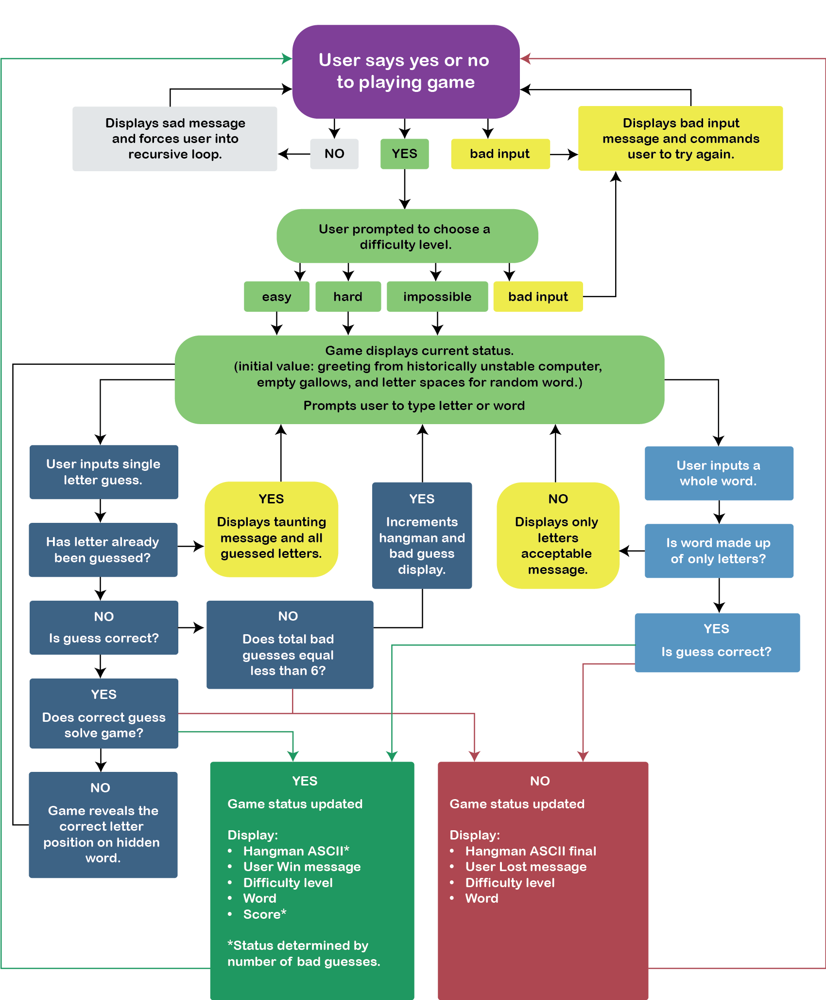

# Contents
* [Team Goal: Create Hangman Game](#team-goal-create-hangman-game)
* [Use Cases](#use-cases)
* [Lessons Learned](#lessons-learned)
* [Future Iterations](#future-iterations)

# Team Goal: Create Hangman Game

# Use Cases: #
* User says NO to playing game
* User can choose Easy, Hard, or Impossible level
* Input is correct letter
* Input is incorrect letter
* Input is empty
* Input is not a letter (number or special character!)
* Input has been previously guessed
* Input is a word (possible sudden death!)
* Game is over. What happens next?

# Lessons Learned
### *planning is the biggest part of team coding*
* Design program flow
* Do UI mockups
* Choose style guide
* Coordinate teammates’ schedule and availability
* Assess individuals’ skills and interests
* Assign roles and responsibilities 
* Identify technical unknowns
* Pick tools for communicating
* Set a base goal (minimum deliverability)
* Set a reach goal (ideal design)

### *good technical communication is good team work*
* Figure out how to use your communication tools (Zoom, Repl.it, Codepad, Slack, good old fashioned telephone, etc.) 
* Commenting code saves time later
* Progress should be reviewed at regular intervals
* Working on different schedules allows for continuious development
* Breaks aren’t a bad thing… fresh eyes help everyone!
* The first way will not necessarily be the final way
* Refactoring team coded programs is hard

# Future Iterations
* Multiple players - store names and scores in individual objects
* Different computer personalities - Mean or nice computer
* Hint option - user pays via score decrementation
* Adding another game - e.g. Wheel of Fortune
* Add ability to have phrases
* Refactoring the code to use ES6
* Restructering the order that functions and function calls appear to make the code more readable

### Biggest takeaway?
> It was stressful working on a tight deadline, but we’d do it again in a heartbeat!
:smile:

